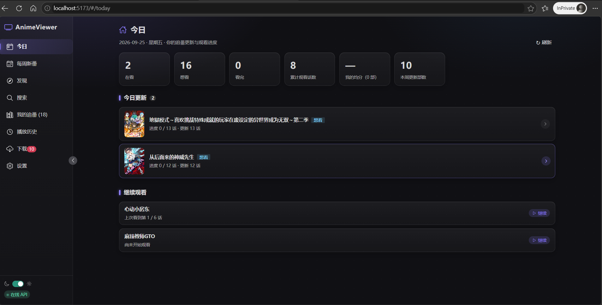
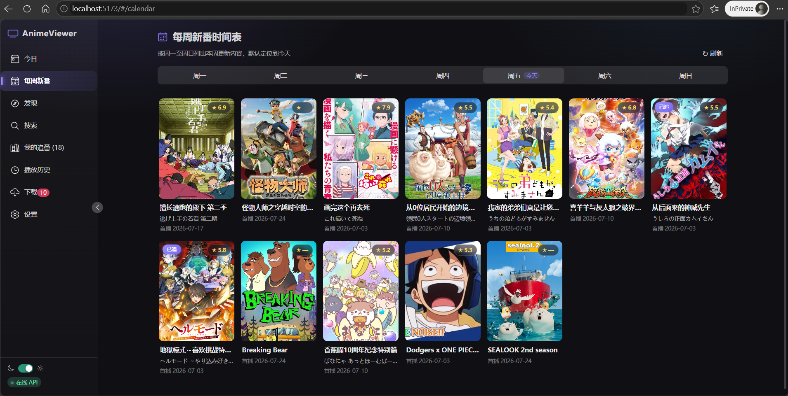
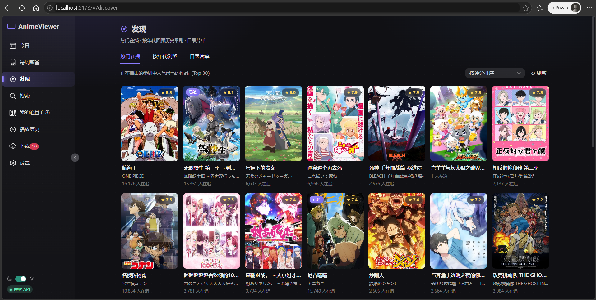
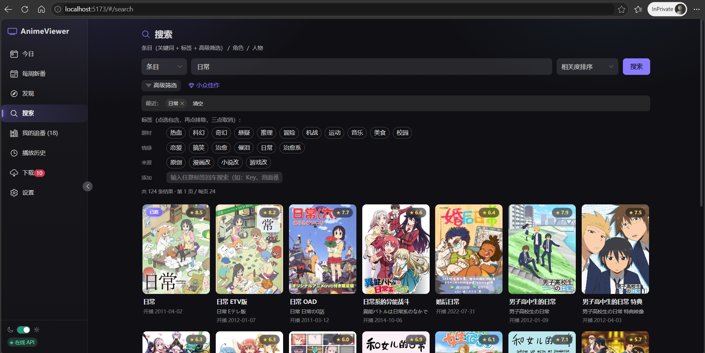
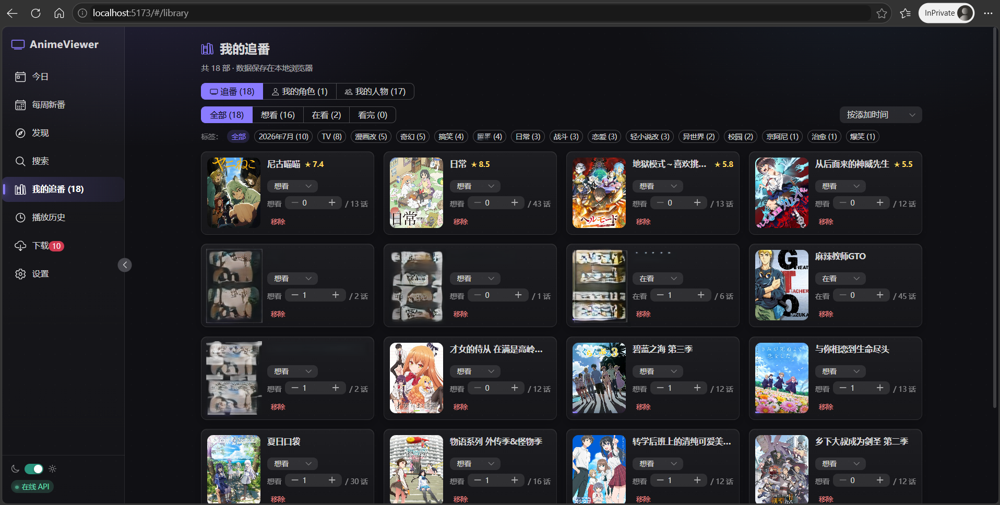
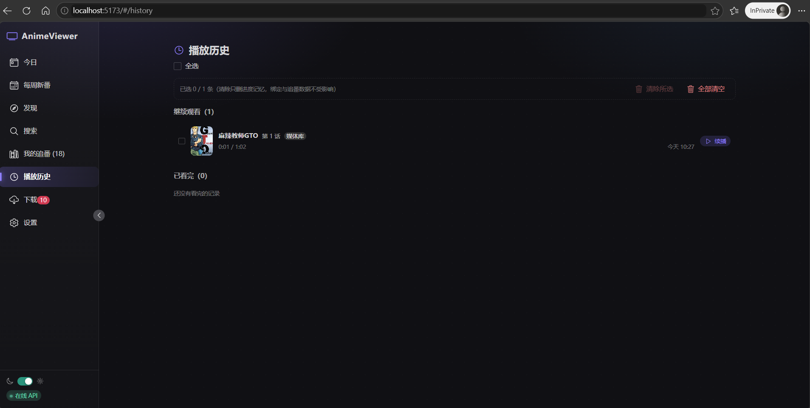
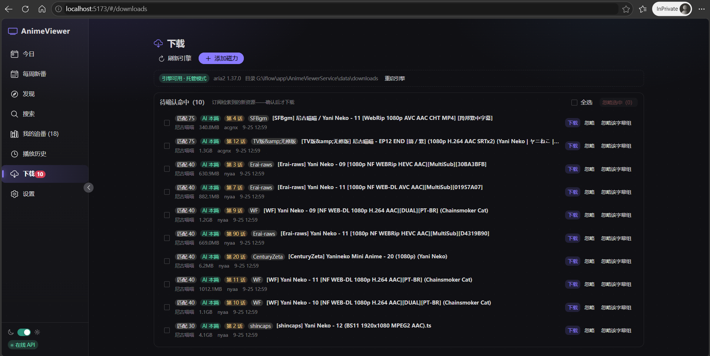
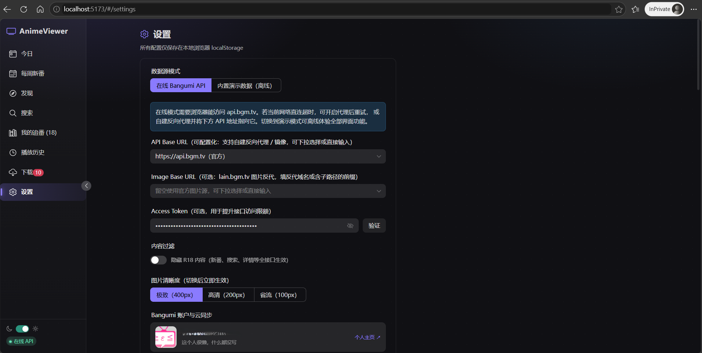

# AnimeViewer - 动漫面板

基于 Vue 3 的本地动漫追番面板，数据来源 [Bangumi API](https://github.com/bangumi/api)。当前版本 v0.30，迭代计划见 `docs/功能迭代文档.md`，部署步骤见 `docs/部署指南.md`。

## 技术栈

- **Vue 3 + TypeScript + Vite**
- **Naive UI** 组件库（暗色主题优先）
- **Pinia** 状态管理（localStorage 持久化）
- **Vue Router**（Hash 模式）

## 快速开始

```bash
npm install
npm run dev     # 开发：http://localhost:5173
npm run build   # 类型检查 + 生产构建
```

## 功能模块

> 以下为在线模式实机截图（暗色主题）。标 ★ 的模块需要配套 [AnimeViewerService](https://github.com/514215834/AnimeViewerService)（可选本地服务端，未部署时相关功能自动降级，其余功能不受影响）。版本级变更历史见 `docs/功能迭代文档.md`。

### 今日仪表盘



- 追番概览统计卡：在看 / 想看 / 看完 / 累计观看话数 / 我的均分 / 本周更新部数
- **今日更新**：周历 × 追番库聚合，今日有更新的追番条目（本地进度与更新话数一目了然），今日无更新自动展开本周分组
- **继续观看**：未看完条目一键续播（本地 / 媒体库 / 在线源统一记忆，精确到集与时间点）
- **新集提醒**：启动 / 切回应用时自动对比追番库与周历，今日有新话 toast 提醒一次（每天至多一次按日节流，设置页可关闭）

### 每周新番时间表



- 周一至周日分页展示每日更新，默认定位到今天
- 卡片含评分徽章、首播日期与「已追」标识（在追条目海报左上角）
- R18 过滤全局生效（按需调 v0 条目接口并发探测 + 结果持久化，避免周历反复请求）
- 周历时间敏感数据仅走会话级内存缓存，刷新即取最新

### 发现



- **热门在播**：正在播出的番剧中人气最高的作品（Top 30），按评分 / 在追人数排序
- **按年代浏览**：年份 + 月份选择，按评分 / 在追人数排序，服务端分页翻页
- **目录片单**：浏览 Bangumi 收录目录（片单）条目并分页
- 在追条目全站显示「已追」徽章；R18 过滤全局生效

### 搜索



- 条目 / 角色 / 人物三类目标分别检索
- 关键词 + 标签**三态筛选**（点选包含 → 再点排除 → 三点取消），支持任意自定义标签
- 高级筛选（开播日期区间、评分下限等多条件）与「小众佳作」一键条件
- 相关度 / 开播时间排序、服务端分页（24 条/页）、最近搜索与条件组合记忆

### 我的追番



- 追番 / 我的角色 / 我的人物三大收藏域，按添加时间 / 评分 / 名称排序
- 想看 / 在看 / 看完状态管理 + 进度话数快捷增减（SP/OP/ED/预告单集独立标记，不污染正篇进度）
- 私有评分与笔记：10 分制评分 + 笔记 + 私密收藏开关（仅自己可见），追番库显示「我的 ★N」
- 标签筛选 chips 与状态分组组合过滤
- 本地持久化 + Bangumi **云端双向同步**（改动队列推送、冲突策略、换机进度恢复），另支持 JSON 导出 / 导入备份
- 演示 / 在线数据双命名空间隔离（演示模式内置离线收藏，互不可见）

### 播放历史



- **继续观看 / 已看完**两组分区，条目带来源标注（媒体库 / 在线源）与最近观看时间
- 一键续播：精确到集与时间点（进度持久化 IndexedDB）
- 多选清除（只删进度记忆，追番记录与设置不受影响）

### 下载中心与订阅自动化 ★



- 三种引擎形态按需选择：**aria2 托管拉起** / aria2 外部实例 / **qBittorrent 外部应用直开**；未配置引擎时降级「一键复制磁力」
- 磁力 / 种子直链入队：元数据解析后按文件清单勾选下载（整季包只下需要的集），任务进度 / 速度 / peer 数如实显示
- **资源搜索**：内置 acgnx / dmhy + 自定义 RSS 站点（注册制、测试连通、启停开关、AI 解析站点参数），多站点并行搜索失败容错合并
- **待确认命中**队列：匹配度评分 / AI 语义判定（本篇·集数）/ 字幕组徽章，一键下载 / 忽略 / 忽略该字幕组并记忆
- **订阅自动化**：条目级订阅定时检索新集，匹配度阈值自动入队（每日上限 / 大小上限 / 仅已匹配三重保护），支持 RSS 固定直链（蜜柑每番 RSS 等）与 AI 解析订阅地址
- 下载完成自动触发媒体库增量扫描，按文件名 / AI 解析绑定条目与集数，剧集 Tab 直接出现播放按钮

### 设置



- **数据源**：在线 Bangumi API / 内置演示数据（离线）；API Base URL 与图片反代可配（预置反代选项 + 任意自建地址）；Access Token 提升限额
- **内容过滤**：R18 隐藏开关全接口生效；图片清晰度三档（400px / 200px / 100px）切换即时生效
- **Bangumi 账户**：OAuth 授权登录 / Token 手动粘贴、收藏云同步（立即同步 + 同步日志）、收藏数据导出导入
- **播放体验**：自动连播、HEVC/10bit 实时转码开关与质量档；更新提醒开关
- **缓存管理**：IndexedDB 持久缓存统计与一键清除（追番与设置不受影响）
- **服务集成**：媒体服务（地址 + Token 配对 + 连接测试）、WebDAV 账号、BT 下载引擎、订阅自动化参数、AI 分析（OpenAI 兼容接口、测试连通、绑定阈值、max_tokens）、在线解析（NSFW 门控 + Cookie 注入）
- **诊断信息**：本地环形错误日志，一键复制反馈（纯本地不上报）

### 条目详情与播放器

- **详情页**：海报 Hero 视觉、标签按全站热度加权展示、简介 / 角色（含声优）/ 制作人员 / 剧集分组（本篇 / SP / OP / ED / 预告 + 关键词过滤）、关联条目导航；角色 / 人物详情页与收藏
- **剧集 Tab 三种取源**：本地播放（目录批量扫描 / 多选 / 拖拽 + 同名外挂字幕）、资源搜索入队下载、在线解析播放（18+ 门控）
- **播放器**（ArtPlayer 按需加载）：本地直连 / 媒体库流（mkv 转封装、内封字幕轨 WebVTT、多音轨、章节跳转、HEVC/10bit 实时转码）/ 在线自备源（直链 / HLS / WebDAV / 服务流代理）+ 弹幕（B 站 XML 本地导入）
- **播放体验**：进度记忆续播、自动连播、上 / 下一集、跳过片头、倍速 / 画中画 / 截图 / 剧场模式、快捷键（空格 / ←→ / F）

## 配置说明（Key 可配置化）

所有配置保存在浏览器 localStorage（`animeviewer:settings`），不经过任何服务器：

- **数据源模式**：`在线 Bangumi API` / `内置演示数据`（离线演示数据，用于无网络环境体验与开发）
- **API Base URL**：默认 `https://api.bgm.tv`（官方），预置 `https://bgmapi.anibt.net` 反代选项；也可直接输入任意自建反代/镜像地址
- **Image Base URL**（图片反代）：默认留空使用官方源，预置 `https://bgmimg.anibt.net` 反代选项；也可直接输入反代域名或含子路径的前缀
- **Access Token**：可选，默认留空（匿名访问）；用于提升接口限额，在 [next.bgm.tv/demo/access-token](https://next.bgm.tv/demo/access-token) 生成后填入，设置页可一键验证有效性（仅保存在本地浏览器，v0.10 起不再内置任何默认 Token）

> 注：浏览器安全策略禁止自定义 `User-Agent` 请求头，如需自定义请在反向代理层注入。

## 性能机制

- **图片加载**：统一走 `PosterImage` 组件——原生 `loading="lazy"` 懒加载 + 骨架屏 + 失败自动重试一次 + 渐变占位兜底，图片持有真实布局盒子（避免 lazy 与隐藏互锁），`decoding="async"` 异步解码
- **尺寸分级（三档可选）**：设置页「图片清晰度」——极致 400px（默认）/ 高清 200px / 省流 100px，覆盖列表海报、追番封面、角色头像与详情主图，切换即时生效；`http://` 图片地址自动升级 `https://`
- **URL 规范化**：Bangumi 各接口的 images 字段语义不一致（legacy 的 common=150px，v0 搜索的 common=400px、large=原图），统一取 l/ 原图路径后注入目标缩放前缀（lain 支持 100/200/400 三档），不依赖字段名；注入幂等，历史数据的堆叠前缀自动纠正（lain 缩放仅支持 200/400 两档，档位按实测约束映射）
- **渲染优化**：所有列表卡片 `content-visibility: auto` + `contain-intrinsic-size`，屏外内容跳过渲染与布局
- **双层缓存**：内存 TTL（会话内新鲜度 5/10/30min）+ IndexedDB 持久层（24h 兜底，手写轻量 KV 零依赖），内存 miss 先查持久层再打网络；周历时间敏感仅内存缓存；设置页「缓存管理」可查看统计并一键清除
- **按需加载**：演示数据动态 import（在线模式不下载）；路由全量懒加载；vendor chunk（vue/naive-ui）独立分包
- **长列表**：搜索服务端分页（24/页）、周历按 Tab 惰性挂载；虚拟滚动顺延，触发条件：追番库 >300 条或目录片单单页 >200（见迭代文档 §4I）
- **响应式**：≤768px 抽屉导航 + 两级卡片栅格断点（126/116px）；动效尊重 `prefers-reduced-motion`

## 已知限制

1. `/calendar` 旧接口不返回 `nsfw` 字段，周历侧过滤需按需调 v0 详情接口（已实现并发检查 + 缓存）
2. R18 过滤效果取决于 Bangumi 官方 `nsfw` 标记的完整性
3. 直连 `api.bgm.tv` 在部分网络环境超时，需系统代理或自建反代（应用内偶发瞬时失败可直接点重试）
4. 条目/角色/人物的云端「取消收藏」端点服务端均未实现（规范已声明，实测 404），取消只能通过 bgm.tv 网页端操作；应用内为「移出本地」语义
5. Bangumi 官方注明：修改评分/评价时收藏 `updated_at` 不刷新（官方 bug）——同步对评分/笔记/私密标记采用「非 dirty 条目无条件跟随云端」策略绕开
6. 非本篇（SP/OP/ED/预告）单集标记为「只推不拉」：换设备后该类勾选状态不从云端回填（云端拉取仅恢复正篇记录）

## 目录结构

```
src/
├── api/          # Bangumi API 客户端（TTL 缓存）+ 演示数据 + 数据源门面
├── components/   # AnimeCard / PosterImage（重试 + 骨架屏）
├── layouts/      # 侧边栏主布局
├── router/       # 路由（Hash 模式）
├── stores/       # settings / library / nsfw（Pinia + localStorage）
├── types/        # Bangumi 接口类型定义
├── utils/        # storage 工具
└── views/        # Today / Calendar / Discover / Search / Library / Detail / Settings 等
```
